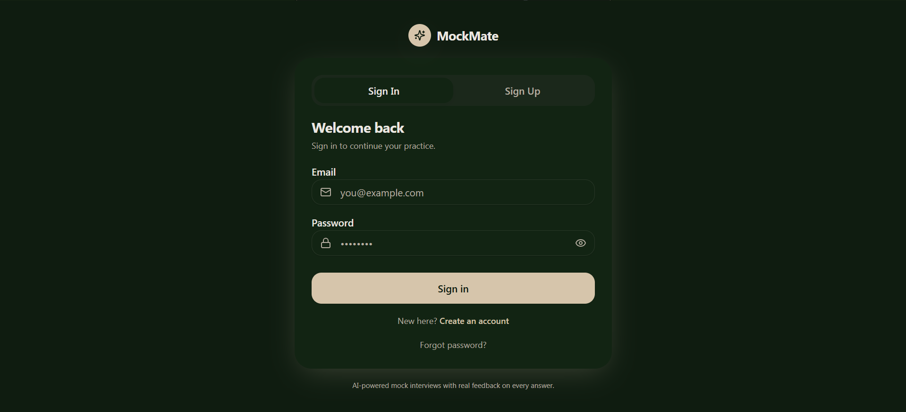
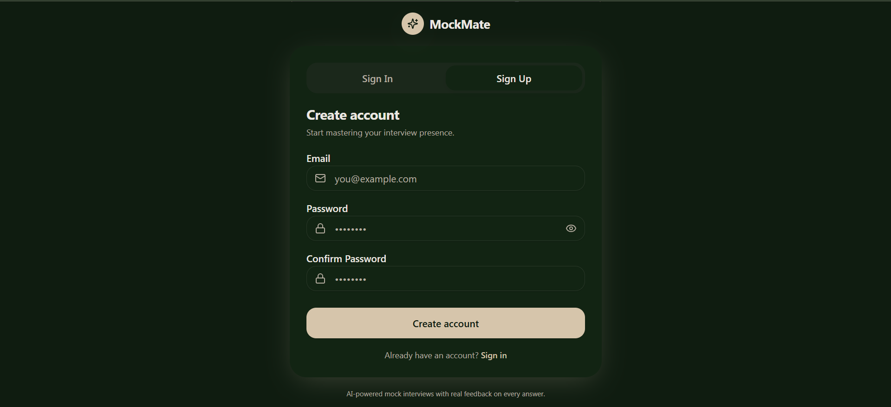
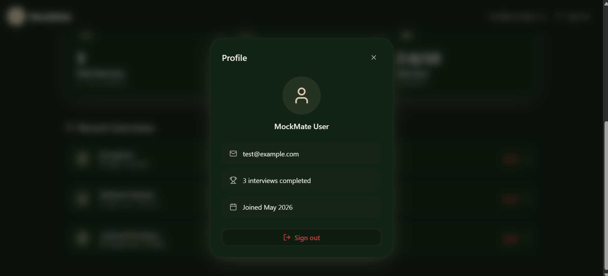
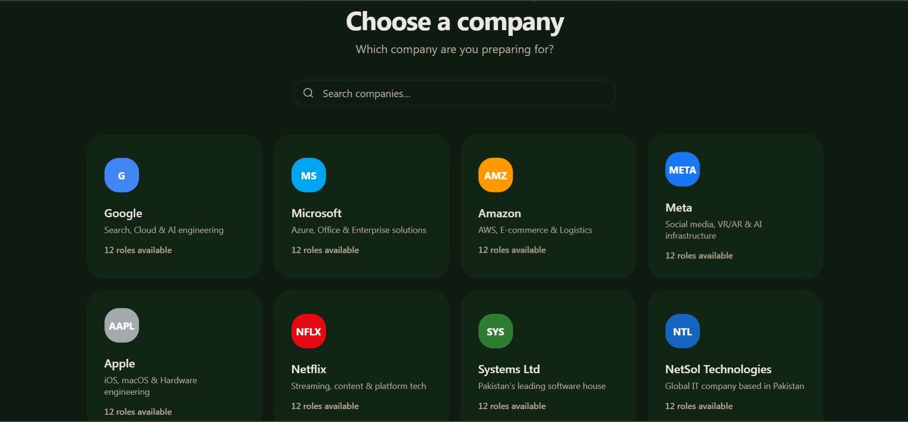
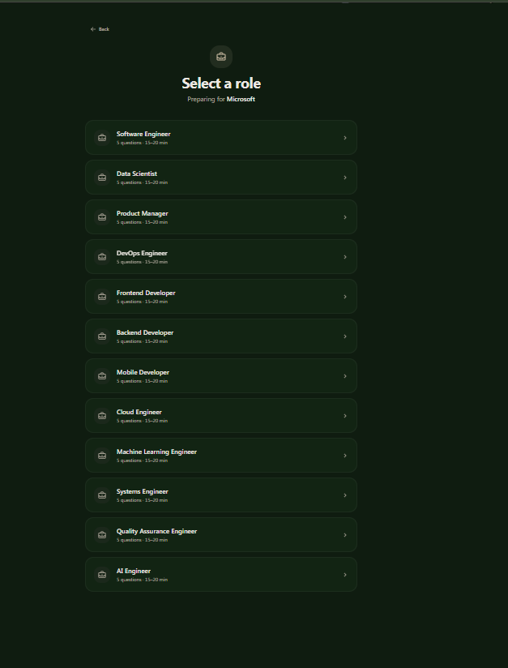
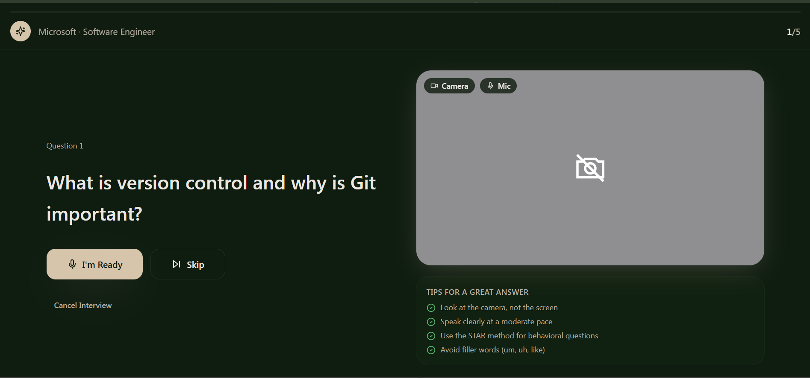
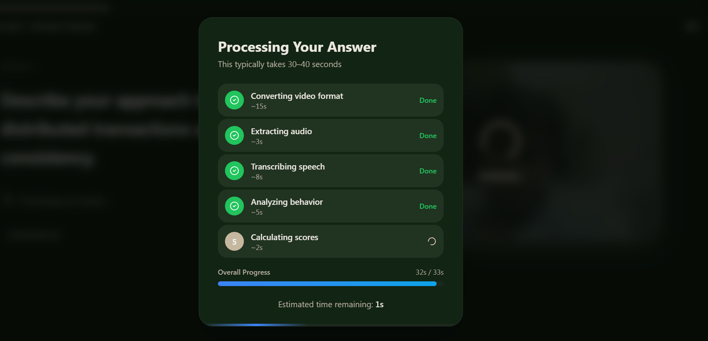
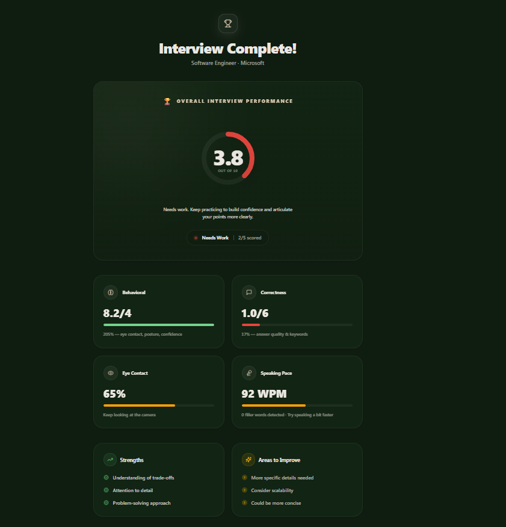
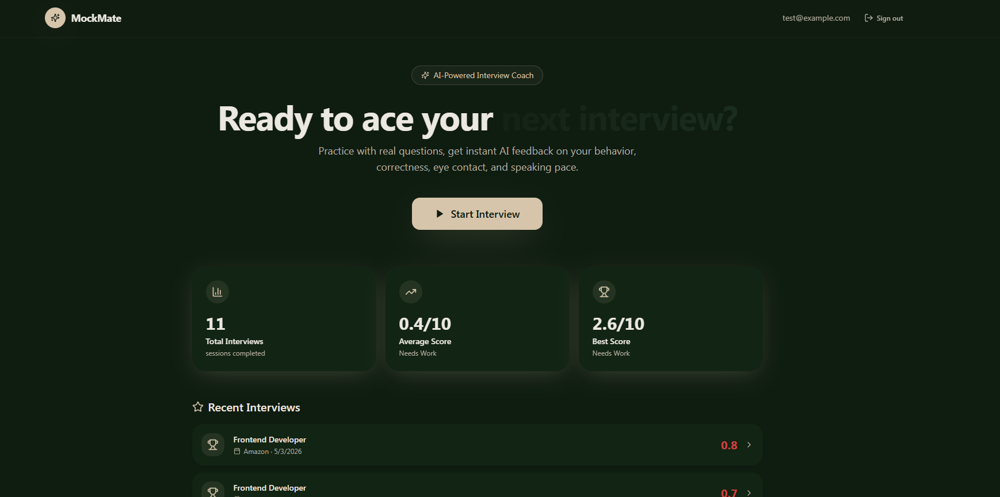

<p align="center">
  
  
</p>
<p align="center">
  
  
</p>
<p align="center">
  
  
</p>
<p align="center">
  
  
</p>
<p align="center">
  
</p>

# MockMate

A professional-grade AI mock interview platform that simulates real technical and behavioral interviews. Track your performance, practice under pressure, and ace your next job interview.

## 🧾 Overview
MockMate is a full-featured mock interview application designed for job seekers and professionals who want to practice their interview skills. It provides real-time video analysis, AI-driven behavioral scoring, and correctness feedback—all in one beautifully designed, dark-themed platform.
From uploading your CV to practicing custom questions based on your target role, MockMate keeps you prepared and confident.

## ✨ Key Features
- 🧠 **AI-Powered Scoring** — Live analysis of both behavioral metrics (eye contact, posture) and answer correctness.
- 📹 **Real-Time Video Processing** — Built-in recording with immediate OpenCV and MediaPipe tracking.
- 🔁 **Custom Question Generation** — Automatically creates relevant questions based on your uploaded CV and target role.
- 📋 **Detailed Performance Reports** — Comprehensive dashboard showing your overall score, strengths, and areas for improvement.
- 📲 **Instant Feedback** — Generates dynamic follow-up questions to test your depth of knowledge.
- 🎨 **Premium UI** — Sleek, modern interface using TailwindCSS, Glassmorphism, and Framer Motion.

## 🏗️ Tech Stack

### Frontend
- **React & Vite**
- **TanStack Router**
- **TailwindCSS & Framer Motion**
- **Firebase Auth**

### Backend
- **Python & Flask**
- **OpenCV & MediaPipe** (Video Analysis)
- **Google Gemini API** (AI Scoring)
- **FFmpeg** (Video Conversion)

## 🖼️ App Architecture
```text
mock-interviewer/
├── backend/
│   ├── tests/          # Validation and pipeline testing
│   ├── data/           # Question banks and caching
│   ├── ml/             # ML inference models
│   └── *.py            # Core video processors and AI scorers
└── frontend/
    ├── src/
    │   ├── components/ # Reusable UI components
    │   ├── routes/     # TanStack application views
    │   └── store/      # Global state management
    └── index.html
```

### Prerequisites
- Node.js (v18+)
- Python (3.9+)
- FFmpeg (Must be installed and in PATH)

### Setup
1. Clone the repository:
```bash
git clone https://github.com/Abdulrehman0911/Mock-Interviewer.git
cd Mock-Interviewer
```

2. Setup Backend:
```bash
cd mock-interviewer/backend
python -m venv .venv
# Activate venv (Windows: .venv\Scripts\activate | Mac/Linux: source .venv/bin/activate)
pip install -r requirements.txt
python app.py
```

3. Setup Frontend:
```bash
cd mock-interviewer/frontend
npm install
npm run dev
```

## 📂 Project Info
Professional AI Mock Interview Platform.

**Note:** Video processing happens locally to respect your privacy, and scores are securely stored via Firebase.