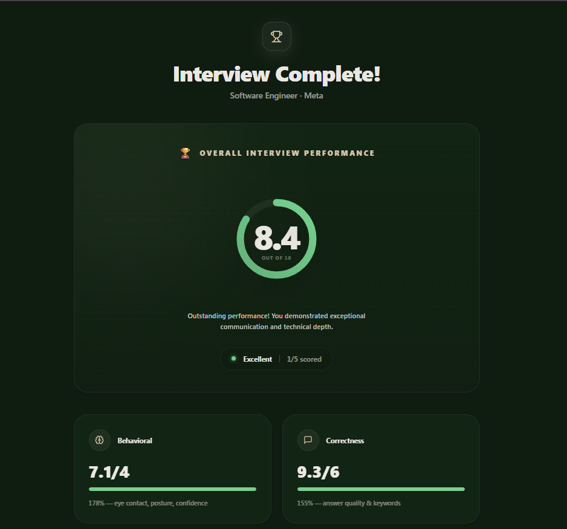

<div align="center">

<h1>MockMate</h1>
<p><strong>AI-Powered Mock Interview Platform</strong></p>
<p>Practice interviews with real-time behavioral analysis, speech transcription, and intelligent answer scoring — all running locally on your machine.</p>

<br/>

</div>

---

## Screenshots

<table>
  <tr>
    <td align="center">
      
      <br/><sub><b>Sign Up</b></sub>
    </td>
    <td align="center">
      
      <br/><sub><b>Sign In</b></sub>
    </td>
  </tr>
  <tr>
    <td align="center">
      
      <br/><sub><b>Home Dashboard</b></sub>
    </td>
    <td align="center">
      
      <br/><sub><b>Profile</b></sub>
    </td>
  </tr>
  <tr>
    <td align="center">
      
      <br/><sub><b>Select Company</b></sub>
    </td>
    <td align="center">
      
      <br/><sub><b>Select Role</b></sub>
    </td>
  </tr>
  <tr>
    <td align="center">
      
      <br/><sub><b>Interview Screen</b></sub>
    </td>
    <td align="center">
      
      <br/><sub><b>Video Processing</b></sub>
    </td>
  </tr>
  <tr>
    <td align="center" colspan="2">
      
      <br/><sub><b>Result Report</b></sub>
    </td>
  </tr>
</table>

---

## Overview

MockMate is a full-stack AI mock interview platform that simulates real technical and behavioral interviews. It records your video responses, transcribes your speech locally using Whisper, analyzes your body language with MediaPipe, scores your answers against a curated keyword bank, and delivers a detailed performance report — all without sending your video to any external server.

The frontend is inspired by modern SaaS design language (Lovable-style), built with React 19, TanStack Router, TailwindCSS v4, and Framer Motion for a premium, fluid experience. The backend is a Python Flask API that orchestrates the entire AI pipeline from video ingestion to final scoring.

---

## Key Features

- **Behavioral AI Scoring** — A custom-trained Random Forest Regressor scores your delivery based on eye contact, head pose, posture, facial stability, speech pace, filler words, and pause patterns.
- **Answer Correctness Scoring** — Keyword-based matching against a curated answer bank across 12 job roles with fuzzy matching for natural language variation.
- **Local Speech Transcription** — Faster-Whisper runs entirely on-device; your audio never leaves your machine.
- **Real-Time Video Analysis** — MediaPipe face mesh and pose landmarks extracted frame-by-frame from your recorded video.
- **Detailed Performance Reports** — Score breakdown (behavioral 40% + correctness 60%), strengths, improvement areas, follow-up questions, and performance tier.
- **Interview History** — All past interviews persisted locally with scores, transcripts, and feedback accessible from the home dashboard.
- **12 Roles × 8 Companies** — Questions tailored to specific roles (Software Engineer, Data Scientist, Product Manager, etc.) across major tech companies.
- **Premium Dark UI** — Glassmorphism cards, animated score rings, smooth transitions, and confetti celebrations on high scores.

---

## Tech Stack

### Frontend

| Technology | Purpose |
|---|---|
| React 19 + Vite | Core framework and build tool |
| TanStack Router v1 | File-based client-side routing |
| TailwindCSS v4 | Utility-first styling with custom dark theme |
| Framer Motion | Page transitions and micro-animations |
| Radix UI (30+ primitives) | Accessible headless UI components |
| Zustand | Lightweight global state management |
| TanStack Query v5 | Async server state and caching |
| Axios | HTTP client with 60s timeout for video uploads |
| Firebase Auth v10 | Email/password authentication |
| Recharts | Score visualization charts |
| React Hook Form + Zod | Form handling and validation |
| canvas-confetti | Celebration animations on high scores |
| Sonner | Toast notifications |

### Backend

| Technology | Purpose |
|---|---|
| Python 3.9+ | Core runtime |
| Flask + Flask-CORS | REST API server |
| OpenCV (cv2) | Frame extraction and video I/O |
| MediaPipe | Face mesh, pose estimation, landmark detection |
| Faster-Whisper | Local speech-to-text transcription |
| FFmpeg (bundled) | WebM → MP4 conversion, audio extraction |
| scikit-learn | Random Forest model training and inference |
| NumPy + Pandas | Feature computation and data handling |
| python-dotenv | Environment variable management |
| firebase-admin | Firebase integration |

---

## Project Structure

```
MockMate/
│
├── backend/
│   ├── app.py                    # Flask server — all API endpoints
│   ├── evaluator.py              # Orchestrates behavioral + correctness scoring
│   ├── correctness_scorer.py     # Keyword matching and answer quality scoring
│   ├── model_inference.py        # Random Forest inference wrapper
│   ├── video_processor.py        # Full video pipeline orchestration
│   ├── mediapipe_analyzer.py     # Eye contact, posture, head pose analysis
│   ├── feature_extractor.py      # WPM, pause count, filler word extraction
│   ├── video_converter.py        # WebM to MP4 conversion via FFmpeg
│   ├── question_manager.py       # Role-based question loading and retrieval
│   ├── session_manager.py        # Session state management
│   ├── prompts.py                # Feedback templates and performance level strings
│   ├── cv_parser.py              # CV/resume PDF parsing utility
│   ├── requirements.txt
│   │
│   ├── data/
│   │   └── questionsAnswers.json # 12 roles × N questions with keywords
│   │
│   ├── ml/
│   │   ├── answer_scoring_model.pkl   # Trained Random Forest (production)
│   │   ├── feature_scaler.pkl         # Fitted StandardScaler
│   │   ├── dataset.csv                # 275 synthetic training samples
│   │   ├── train_model.py             # Model training script
│   │   ├── evaluate_model.py          # Model evaluation and comparison
│   │   ├── generate_dataset.py        # Synthetic dataset generation
│   │   └── model_training_report.md   # Training results and metrics
│   │
│   └── tests/
│       ├── test_comprehensive_analysis.py
│       ├── test_final_validation.py
│       ├── test_model_inference.py
│       └── test_scoring_pipeline.py
│
└── frontend/
    ├── index.html
    ├── vite.config.ts
    ├── package.json
    │
    └── src/
        ├── main.tsx
        ├── router.tsx
        ├── routes/
        │   ├── __root.tsx          # Root layout with auth guard
        │   ├── index.tsx           # Redirects to /home
        │   ├── auth.tsx            # Sign in / Sign up
        │   ├── home.tsx            # Dashboard with interview history
        │   ├── select-company.tsx  # Company picker
        │   ├── select-role.tsx     # Role picker
        │   ├── interview.tsx       # Video recording and submission
        │   └── report.tsx          # Results and feedback display
        ├── components/
        │   ├── interview/
        │   │   └── ProcessingOverlay.tsx   # 5-step progress modal
        │   └── ui/                         # Radix UI wrappers (30+ components)
        ├── store/
        │   ├── interviewStore.ts   # Interview state, questions, results, history
        │   └── authStore.ts        # User and auth state
        ├── hooks/
        │   ├── use-auth.ts         # Firebase auth hook
        │   └── use-mobile.tsx      # Responsive breakpoint hook
        ├── lib/
        │   ├── api.ts              # Axios API client
        │   ├── companies.ts        # 8 companies + 12 roles definitions
        │   ├── firebase.ts         # Firebase config
        │   └── utils.ts            # Shared utilities
        └── types/
            └── index.ts            # TypeScript type definitions
```

---

## Full Pipeline & User Flow

```
┌─────────────────────────────────────────────────────────────────┐
│                        USER JOURNEY                             │
└─────────────────────────────────────────────────────────────────┘

  1. AUTHENTICATION
     /auth → Firebase email/password sign in or sign up
     On success → redirect to /home

  2. HOME DASHBOARD
     /home → View past interview history, average scores,
             best performance, and start a new interview

  3. COMPANY SELECTION
     /select-company → Choose from 8 companies
                        (Google, Amazon, Microsoft, Meta, etc.)

  4. ROLE SELECTION
     /select-role → Choose from 12 roles
                     (Software Engineer, Data Scientist,
                      Product Manager, DevOps, etc.)

     GET /api/questions/<role>?count=5
     → question_manager.py loads questionsAnswers.json
     → Returns 5 randomly sampled questions for that role

  5. INTERVIEW RECORDING
     /interview → Camera and microphone activated via getUserMedia()
                  MediaRecorder records in WebM/VP9 format
                  Question displayed, user clicks "I'm Ready"
                  Recording starts, user answers, clicks "Submit"
                  One question at a time, repeated for all 5

  6. VIDEO PROCESSING PIPELINE
     POST /api/process-video (multipart/form-data)
     Payload: video blob, question_id, question_text,
              question_difficulty, role

     Step 1 → video_converter.py
              WebM blob saved to temp file
              FFmpeg converts WebM → MP4 (H.264)

     Step 2 → FFmpeg extracts audio
              Output: WAV 16kHz mono

     Step 3 → Faster-Whisper transcribes audio
              Runs fully locally (no external API)
              Output: transcript string

     Step 4 → feature_extractor.py
              Parses transcript for:
              • transcript_length (word count)
              • wpm (words per minute)
              • pause_count (estimated)
              • pause_avg_duration (seconds)
              • filler_count (um, uh, like, basically, etc.)

     Step 5 → mediapipe_analyzer.py
              Extracts frames from MP4
              Runs MediaPipe face mesh + pose estimation
              Computes per-frame:
              • eye_contact_pct   (% of frames with direct gaze)
              • head_pose_score   (0–10, stability of head angle)
              • posture_score     (0–10, shoulder/spine alignment)
              • facial_stability  (0–10, micro-expression control)

  7. DUAL SCORING SYSTEM
     evaluator.py orchestrates two independent scorers:

     A. BEHAVIORAL SCORE  (40% of final)
        model_inference.py feeds 10 features into
        the trained Random Forest Regressor:
        [transcript_length, wpm, pause_count,
         pause_avg_duration, filler_count,
         eye_contact_pct, head_pose_score,
         posture_score, facial_stability,
         question_difficulty]
        → Output: score /10 → weighted to /4

     B. CORRECTNESS SCORE  (60% of final)
        correctness_scorer.py:
        • Strips filler words from transcript
        • Tokenizes into keyword list
        • Fuzzy-matches (threshold 0.8) against
          expected keywords in questionsAnswers.json
        • ≥50% match → HIGH tier  → 8.0–10.0
        • ≥25% match → MEDIUM tier → 5.0–7.5
        • >0%  match → LOW tier   → 2.0–4.5
        • Filler penalty applied for HIGH tier
          answers with excessive filler words
        → Output: score /10 → weighted to /6

     FINAL SCORE = behavioral/4 + correctness/6
                 = 0–10 scale

  8. FEEDBACK GENERATION
     prompts.py selects from curated template banks:
     • Follow-up question (based on score tier)
     • 2 Strengths (sampled from strength pool)
     • 2 Improvements (sampled from improvement pool)
     • Performance level: Excellent / Good / Average / Low

  9. RESULT DISPLAY
     /report → Animated score rings showing final score
               Behavioral vs correctness breakdown
               Transcript display
               Strengths and improvement cards
               Follow-up question for deeper practice
               All data saved to pastInterviews[] in Zustand
```

---

## Machine Learning Model

The behavioral scoring model was **independently trained** by the MockMate team. Three algorithms were compared before selecting the final model.

### Training Data
- **275 synthetic samples** generated via `ml/generate_dataset.py`
- Rule-based labeling across three quality tiers (high / medium / low)
- Realistic feature ranges: WPM 75–220, eye contact 15–90%, etc.
- 80/20 train-test split (220 train, 55 test)

### Model Comparison

| Metric | Linear Regression | **Random Forest** | MLP Neural Net |
|--------|:-----------------:|:-----------------:|:--------------:|
| MAE    | 0.134             | **0.022**         | 0.179          |
| MSE    | 0.036             | **0.011**         | 0.056          |
| R²     | 0.997             | **0.999**         | 0.995          |

**Selected: Random Forest Regressor** — lowest error, highest accuracy.

### Input Features (10)

| Feature | Description |
|---|---|
| `transcript_length` | Word count of the answer |
| `wpm` | Words per minute (speech pace) |
| `pause_count` | Number of detected pauses |
| `pause_avg_duration` | Average pause length in seconds |
| `filler_count` | Count of filler words (um, uh, like…) |
| `eye_contact_pct` | % of frames with direct eye contact |
| `head_pose_score` | Head stability and forward angle (0–10) |
| `posture_score` | Shoulder/spine alignment score (0–10) |
| `facial_stability_score` | Facial expression control (0–10) |
| `question_difficulty` | Question difficulty level (1–3) |

### Sanity Check Results
- High quality answer → **9.0 / 10**
- Medium quality answer → **6.3 / 10**
- Low quality answer → **2.1 / 10**

---

## API Reference

| Method | Endpoint | Description |
|--------|----------|-------------|
| `GET` | `/api/health` | Health check |
| `GET` | `/api/roles` | List all available roles |
| `GET` | `/api/questions/<role>?count=5` | Fetch N random questions for a role |
| `POST` | `/api/process-video` | Full video pipeline → returns scores + feedback |
| `POST` | `/api/evaluate-answer` | Score a single text answer |
| `POST` | `/api/session-summary` | Generate summary report for a full session |

---

## Getting Started

### Prerequisites

- Node.js v18+
- Python 3.9+
- Git

> FFmpeg is bundled automatically via `imageio_ffmpeg` — no manual install needed.

### 1. Clone the Repository

```bash
git clone https://github.com/Abdulrehman0911/Mock-Interviewer.git
cd Mock-Interviewer
```

### 2. Backend Setup

```bash
cd backend

# Create and activate virtual environment
python -m venv .venv
.venv\Scripts\activate          # Windows
# source .venv/bin/activate     # Mac / Linux

# Install dependencies
pip install -r requirements.txt

# Start the server
python app.py
# Server starts at http://localhost:5000
```

### 3. Frontend Setup

```bash
cd frontend

# Install dependencies
npm install

# Start the dev server
npm run dev
# App runs at http://localhost:5173
```

### 4. Environment Variables

Create `backend/.env` based on `.env.example`:

```env
FIREBASE_CREDENTIALS=path/to/serviceAccountKey.json
```

---

## Privacy

All video processing — transcription, face analysis, feature extraction — happens **entirely on your local machine**. No video or audio is ever sent to an external server. Only authentication state is managed through Firebase.

---

<div align="center">
  <p>Built by <strong>Abdul Rehman</strong></p>
</div>
